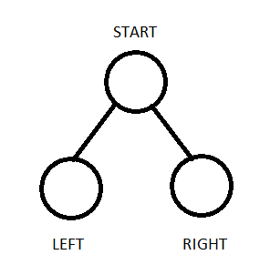

# 01: AI Strategy - Introduction to chess

In this module, we are going to look at **decision trees** which are a means for **AI** to make decisions about what actions to take. The application of these trees can take many forms depending on the context of the game; we are going to look at a very simple example of an AI weighing up all its options before making its 'move' - **Chess**! Now, Chess itself is not simple... and to play it well, you need a lot of knowledge and practice. But it provides a good example for us for a couple reasons: (1) the rules of the game are very well-defined - there are only certain legal moves that can be made at any turn, so this makes the options available easy to evaluate; and (2) it is turn-based, which will be easier for us to deal with than, say, a real-time game where the state-of-play is constantly updating.

## Starter project

Download the **starter code** for this game, which is a fully coded chess game, with all the legal moves etc, already prepared for you :)

## Decision trees

As the name suggests, the idea of **decision trees** are just trees (remember from last module: nodes and edges, in a hierarchical structure) that evaluate different scenarios and assign some sort of **weighting** to those scenarios, positive or negative. Let's consider a very basic example: the **AI** is deciding whether to move **left** or **right**. These form the nodes of the tree:

Now, in this scenario, to the left is a trap that will kill the AI instantly. On the right is a treasure that will reward the AI with 100 pieces of gold. So, the AI is considering a few variables in this move - its **health** and its **amount of gold**. A very simple **evaluation** of this could be something like this: moving **left** will **damage** the AI **100 health** (**-100**) and also yield **no new gold** (**+0**); moving **right** will **not damage** the AI at all (**-0**) and will yield **100 gold** (**+100**). So, the evaluation of each path might look like this to the AI:

It becomes very obvious what path the AI should take for this one step - the one with the **highest evaluation score**. Now, the things that factor into the **evaluation** can be as simple or complex as you want/need for your game. For example, let's say the **AI** has a shield that can mostly protect it from the trap; and let's say also that even **further** to the left is a very large treasure that is worth **1000 gold**. Its decision tree might look like this now:

Now the AI's best move **is** to go left, use its shield, and then move left again - this is where **AI** can become **"smarter"** than human players - the ability to *look ahead* and evaluate hundreds or thousands of options very quickly, and act in its best interest. This is how the first **computer chess** algorithms were able to beat human players. The ability of humans to consider all available options is difficult, especially if the **first option** acutally looks **immediately worse** but is eventually **the best move**.

## A chess algorithm - MiniMax

The algorithm we are going to use in our chess program is a simple **decision tree** called **Minimax** - this algorithm looks at all possible moves by the AI **AND** then all possible moves by the player in response to those AI moves (and then, depending on the depth of the algorithm, again the AI, and again the player, etc, etc). The idea is to **maximise** the AI's score on its turn, and **minimise** the player's score on its turn... 

This works especially well in chess because it is what we call a **zero-sum game**: first, the game *has* an end, and there are 3 ways the game can end and they all 'equal' zero:
- you win (+1) and the opponent loses (-1); 
- you lose (-1) and the opponent wins (+1); 
- or neither of you win (a draw: +0 for both).

So, in its **simplest conception**, each move will determine if anyone 'wins' and attribute **+1**, **-1** or **0**... think about tic tac toe... each turn will eventually lead to one of these outcomes - the **Minimax algorithm** works through every available combination of moves until one of them returns a **+1** - then it walks back up the path that led to that outcome, and makes whatever move is the first in that path (very similar to our **pathfinding algorithm** actually).
